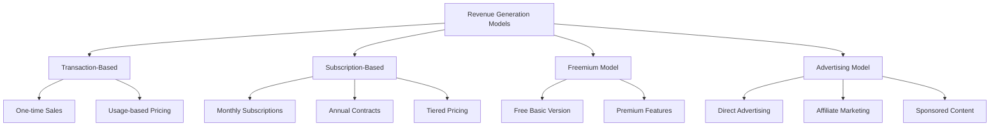
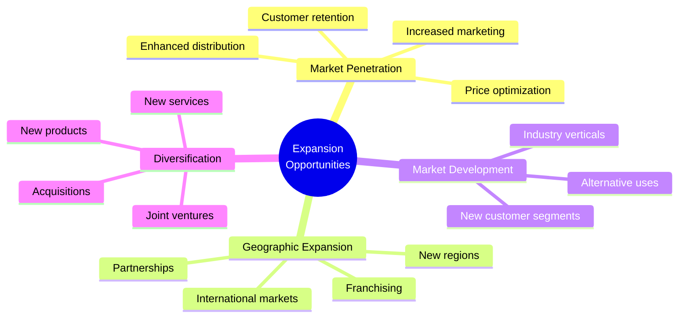
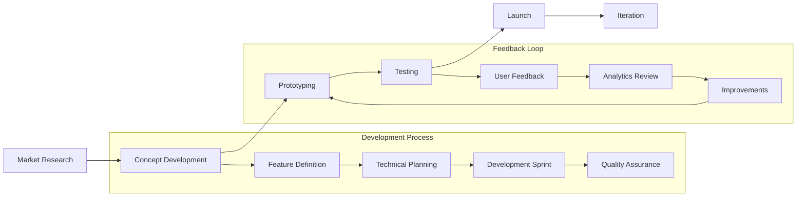
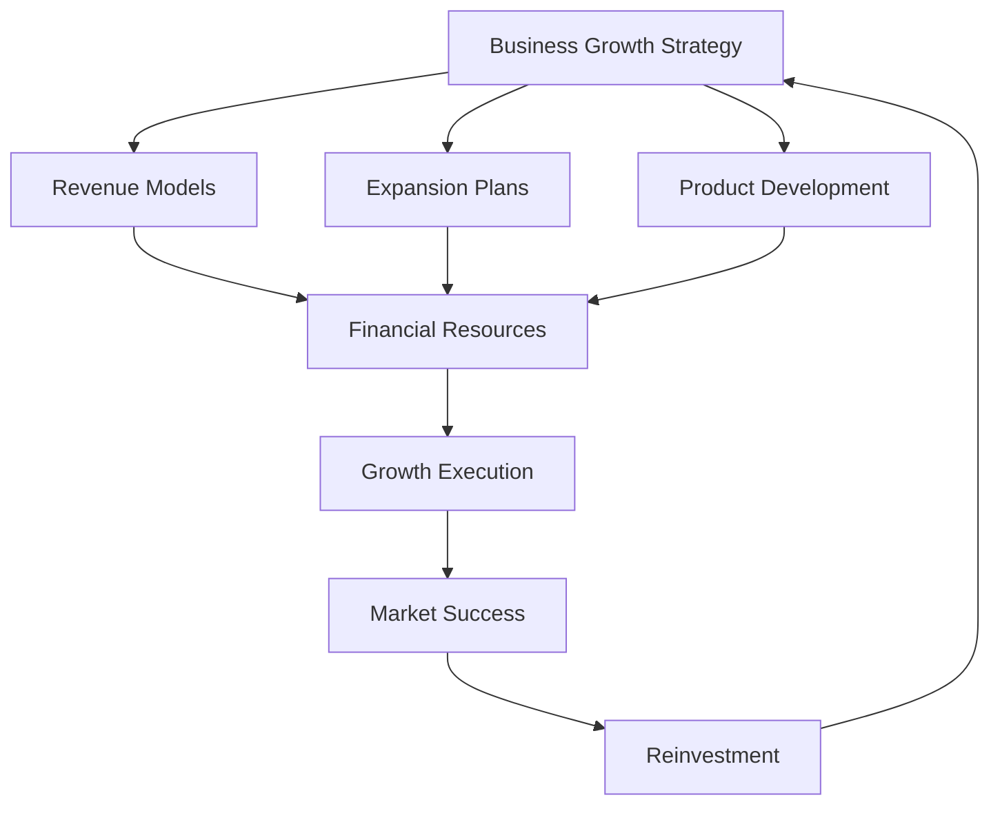

# Business Growth Strategies: A Comprehensive Guide

## 1. Revenue Generation Models

Different approaches to generating and increasing revenue streams:

### Key Considerations for Revenue Models:
- Market fit and customer preferences
- Scalability potential
- Resource requirements
- Profit margins
- Customer lifetime value

## 2. Expansion Opportunities

Strategic approaches to business expansion:

### Critical Success Factors:
1. Market research and validation
2. Resource availability
3. Risk assessment
4. Competitive analysis
5. Timeline planning

## 3. Product/Service Development

Strategic framework for developing new offerings:

### Development Stages

#### 1. Initial Research
- Customer needs analysis
- Market gap identification
- Competitor analysis
- Feasibility study

#### 2. Development Process
- MVP definition
- Feature prioritization
- Resource allocation
- Timeline planning

#### 3. Launch Strategy
- Marketing plan
- Distribution channels
- Pricing strategy
- Support infrastructure

## Integration Framework

How these elements work together:

## Implementation Checklist

- [ ] Define clear objectives and KPIs
- [ ] Assess current market position
- [ ] Identify resource requirements
- [ ] Develop detailed timeline
- [ ] Create risk mitigation plan
- [ ] Establish feedback mechanisms
- [ ] Plan for scalability
- [ ] Set up monitoring systems

## Success Metrics

1. **Financial Metrics**
   - Revenue growth
   - Profit margins
   - Customer acquisition cost
   - Lifetime value

2. **Operational Metrics**
   - Market share
   - Customer satisfaction
   - Product adoption rate
   - Employee productivity

3. **Strategic Metrics**
   - Brand awareness
   - Market position
   - Innovation index
   - Competitive advantage

## Conclusion

Successful business growth requires careful integration of revenue models, expansion strategies, and product development. Regular monitoring and adjustment of these elements ensures sustainable growth and market success.
