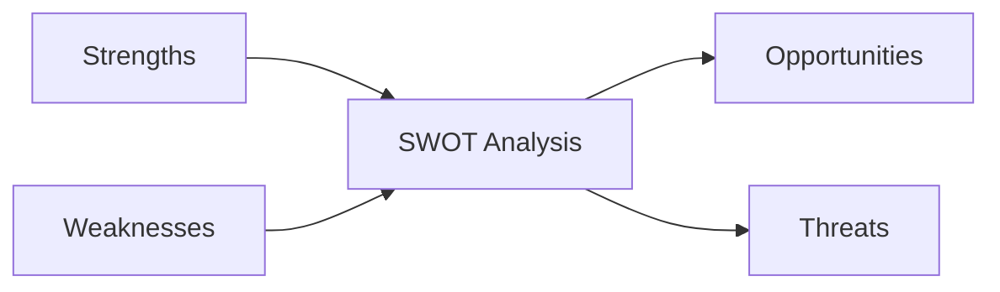
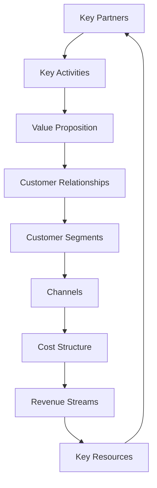
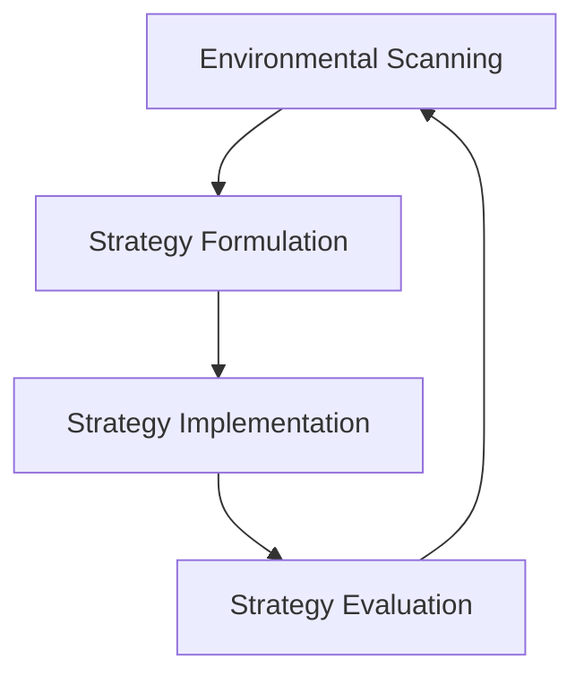

## Introduction

Developing a robust business strategy is essential for organizations to navigate the ever-evolving competitive landscape and achieve sustainable growth. In this document, we will explore the key components of business strategy development, including SWOT analysis, the business model canvas, and the strategic planning process, accompanied by informative Mermaid diagrams to illustrate these crucial concepts.

## SWOT Analysis
SWOT (Strengths, Weaknesses, Opportunities, Threats) analysis is a powerful tool for assessing an organization's internal and external environment. By identifying these critical factors, businesses can make informed decisions and formulate effective strategies.

The Mermaid diagram above depicts the four key elements of a SWOT analysis and their interconnectedness. By thoroughly evaluating these factors, organizations can leverage their strengths, address their weaknesses, capitalize on emerging opportunities, and mitigate potential threats.

## Business Model Canvas
The Business Model Canvas is a strategic management tool that provides a holistic view of an organization's business model. It encompasses nine essential building blocks, allowing businesses to understand and communicate their value proposition, customer segments, key resources, and other critical components.

The Mermaid diagram above illustrates the nine interconnected elements of the Business Model Canvas, highlighting the comprehensive nature of this strategic planning tool.

## Strategic Planning
The strategic planning process involves the development and implementation of a long-term plan to achieve an organization's desired goals and objectives. This process typically includes the following key steps:

The Mermaid diagram above depicts the cyclical nature of the strategic planning process, where environmental scanning, strategy formulation, implementation, and evaluation are continuously evaluated and refined to ensure the organization's long-term success.

## Conclusion
Effective business strategy development is a crucial component of organizational success. By leveraging tools like SWOT analysis, the Business Model Canvas, and the strategic planning process, businesses can gain a comprehensive understanding of their internal and external environments, identify their unique value propositions, and formulate and execute strategic initiatives that drive sustainable growth. The Mermaid diagrams presented in this document provide a visual framework for understanding and implementing these essential elements of business strategy development.

