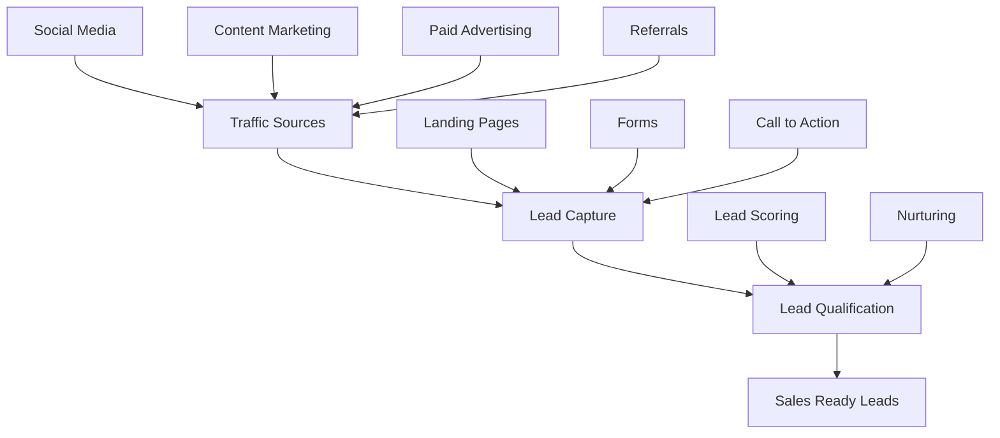
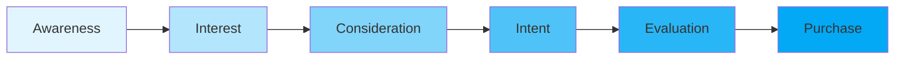
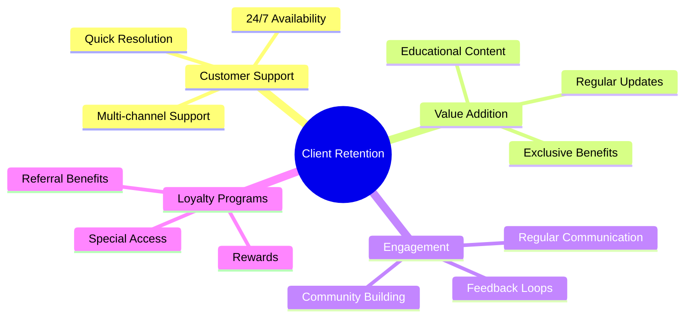
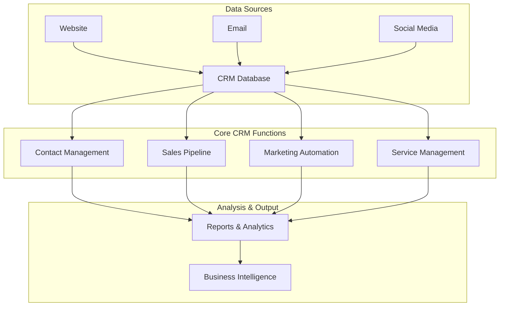

# Client Outreach and Relationship Management: A Comprehensive Guide

## 1. Lead Generation

Lead generation is the process of attracting and converting prospects into potential customers. Here's a visualization of the lead generation funnel:



### Key Lead Generation Strategies:
- Content Marketing (blogs, whitepapers, ebooks)
- Social Media Marketing
- Search Engine Optimization (SEO)
- Email Marketing Campaigns
- Referral Programs
- Event Marketing

## 2. Customer Acquisition Strategies

The customer acquisition process can be visualized as follows:



### Effective Acquisition Channels:
1. Digital Marketing
   - PPC Advertising
   - Social Media Campaigns
   - Content Marketing
2. Traditional Marketing
   - Print Media
   - Trade Shows
   - Direct Mail
3. Partnership Marketing
   - Co-marketing
   - Affiliate Programs
   - Strategic Alliances

## 3. Client Retention Techniques

Here's a visualization of the key elements in client retention:



### Retention Best Practices:
- Regular Check-ins
- Personalized Communication
- Proactive Problem Resolution
- Value-added Services
- Customer Feedback Implementation
- Loyalty Programs

## 4. CRM (Customer Relationship Management) Systems

Here's a comprehensive view of a typical CRM system architecture:



### Key CRM Features:
1. Contact Management
   - Customer Profiles
   - Interaction History
   - Document Management

2. Sales Management
   - Pipeline Tracking
   - Opportunity Management
   - Forecasting

3. Marketing Automation
   - Campaign Management
   - Email Marketing
   - Lead Scoring

4. Service Management
   - Ticket Management
   - Knowledge Base
   - Service Level Agreements

### Best Practices for CRM Implementation:
- Define Clear Objectives
- Ensure Data Quality
- Train Users Properly
- Regular System Updates
- Integration with Other Tools
- Mobile Accessibility

## Measuring Success

Key Performance Indicators (KPIs) to track:

```mermaid
graph TD
    A[Key Performance Indicators] --> B[Acquisition Metrics]
    A --> C[Retention Metrics]
    A --> D[Engagement Metrics]
    A --> E[Financial Metrics]
    
    B --> B1[Cost per Lead]
    B --> B2[Conversion Rate]
    B --> B3[Customer Acquisition Cost]
    
    C --> C1[Customer Retention Rate]
    C --> C2[Churn Rate]
    C --> C3[Customer Lifetime Value]
    
    D --> D1[Engagement Score]
    D --> D2[NPS Score]
    D --> D3[Customer Satisfaction]
    
    E --> E1[Revenue per Customer]
    E --> E2[Profit Margins]
    E --> E3[ROI]
