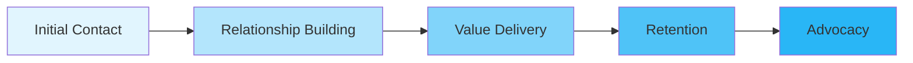
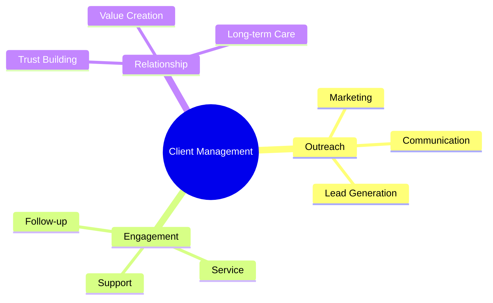
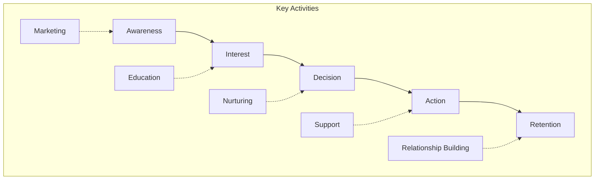
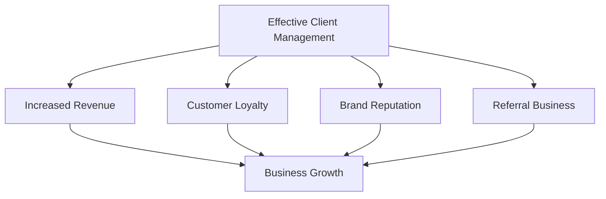
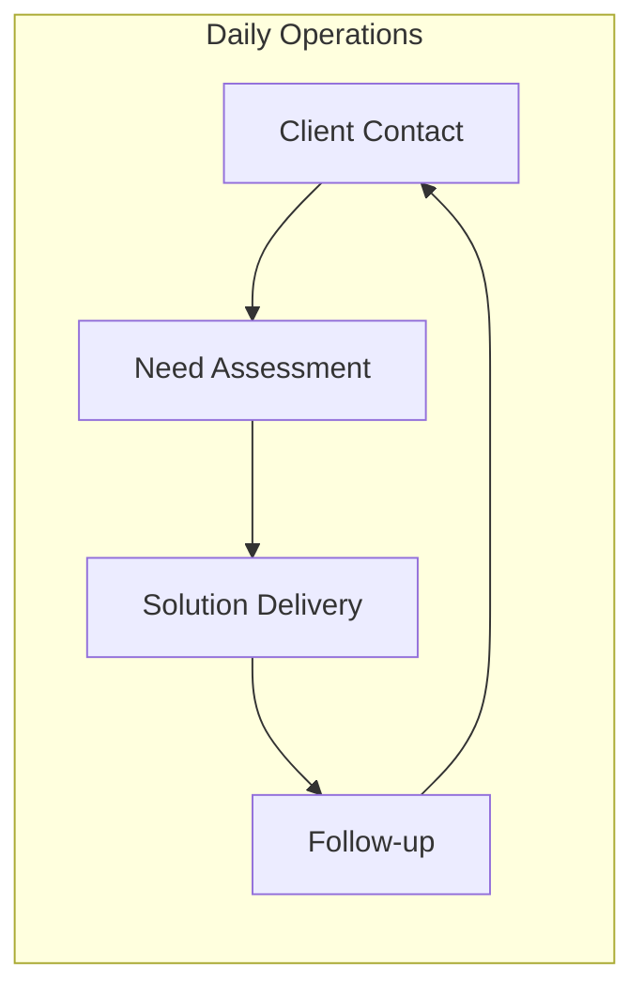
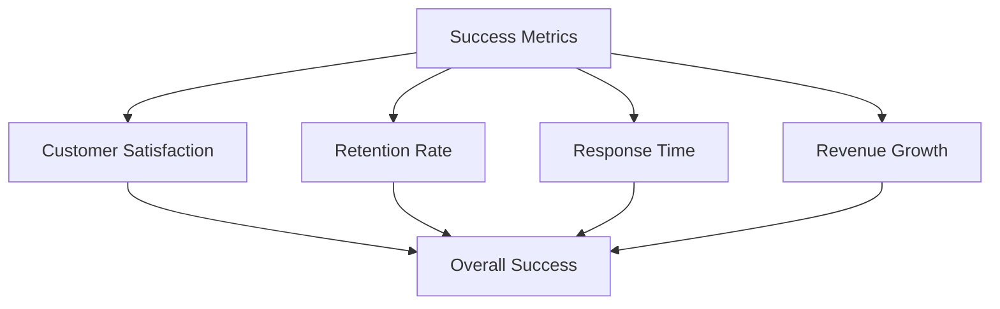

# Introduction to Client Outreach and Relationship Management

## What is Client Outreach and Relationship Management?

Client Outreach and Relationship Management is the strategic process of building and maintaining strong connections with customers throughout their journey with your business.

## Core Components

## The Customer Journey

Every client relationship follows a basic journey:

## Benefits of Effective Client Management

## Basic Implementation Framework

1. **Initial Setup**
   - Define target audience
   - Create communication channels
   - Establish tracking systems

2. **Engagement Process**
   - Regular communication
   - Value delivery
   - Feedback collection

3. **Relationship Building**
   - Personalized approach
   - Problem resolution
   - Continuous improvement

## Key Success Metrics

Monitor these essential metrics to gauge effectiveness:

## Getting Started Tips

1. **Start Small**
   - Focus on key clients
   - Test different approaches
   - Gather feedback

2. **Use Technology**
   - CRM software
   - Communication tools
   - Analytics platforms

3. **Build Gradually**
   - Expand systematically
   - Train team members
   - Refine processes

## Remember

- Client relationships are long-term investments
- Consistent communication is key
- Value delivery should be ongoing
- Regular feedback helps improve service
- Personal touch matters

This introduction provides a foundation for understanding client outreach and relationship management. As you implement these concepts, remember that every business is unique and may require customized approaches.
