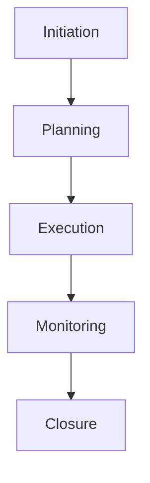
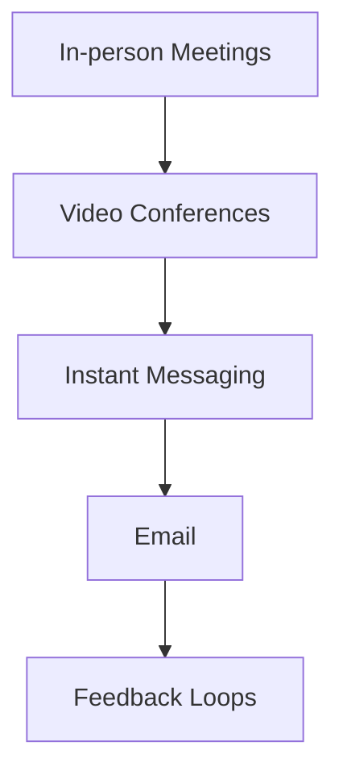
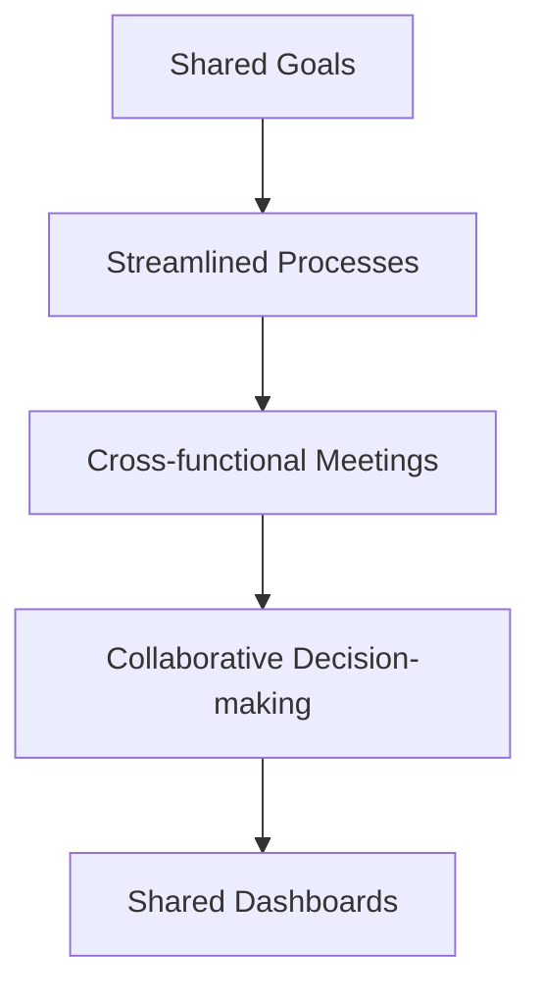

## Introduction

Effective cross-functional collaboration is essential for organizations to thrive in today's dynamic business landscape. By breaking down silos and fostering coordination across different departments and teams, companies can unlock enhanced productivity, innovation, and customer value. In this document, we'll explore the key pillars of cross-functional collaboration, including project management, team communication, and interdepartmental coordination, and provide Mermaid diagrams to illustrate these concepts.

## Project Management
Successful project management is the backbone of cross-functional collaboration. When teams from various departments work together towards a common goal, aligning on project objectives, timelines, and responsibilities is crucial.

*Figure 1: A project management framework highlighting the key stages from initiation to closure.*

The project management framework outlined in Figure 1 provides a structured approach to ensure seamless collaboration, clear communication, and efficient task allocation across functional boundaries. By adhering to this process, organizations can minimize roadblocks, optimize resource utilization, and deliver successful project outcomes.

## Team Communication
Effective communication is the lifeblood of cross-functional collaboration. Teams must establish open and transparent channels of information sharing to foster trust, align on priorities, and address challenges proactively.

*Figure 2: Visualization of various communication channels used in cross-functional collaboration.*

As illustrated in Figure 2, organizations should leverage a variety of communication channels to cater to the diverse needs and preferences of team members. Regular check-ins, status updates, and feedback loops help maintain alignment and ensure everyone is on the same page.

## Interdepartmental Coordination
Seamless coordination across different departments is essential for driving cross-functional collaboration. By aligning on shared goals, streamlining processes, and fostering a culture of mutual understanding, organizations can break down silos and capitalize on the collective expertise of their workforce.

*Figure 3: Depiction of interdepartmental coordination in cross-functional collaboration.*

As shown in Figure 3, cross-functional collaboration requires a concerted effort from all departments, including sales, marketing, finance, HR, and IT, to work in harmony towards the organization's overarching objectives. Regular cross-functional meetings, shared dashboards, and collaborative decision-making processes can facilitate this coordination and promote a holistic, enterprise-wide approach to problem-solving.

## Conclusion
Cross-functional collaboration is a strategic imperative for organizations seeking to thrive in today's competitive landscape. By embracing effective project management, fostering robust team communication, and encouraging seamless interdepartmental coordination, companies can unlock enhanced productivity, innovation, and customer value. The Mermaid diagrams presented in this document provide a framework for understanding and implementing these crucial elements of cross-functional collaboration.

