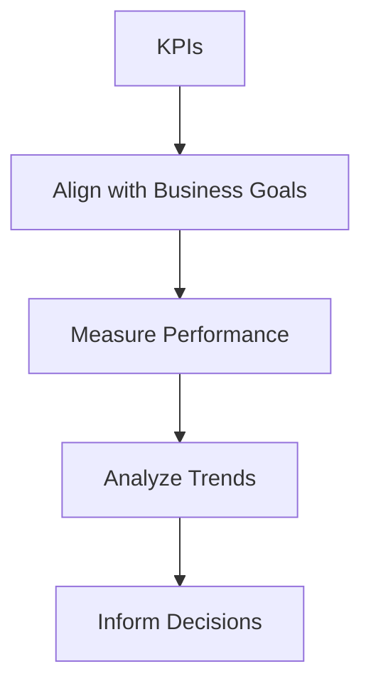
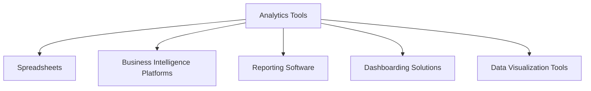
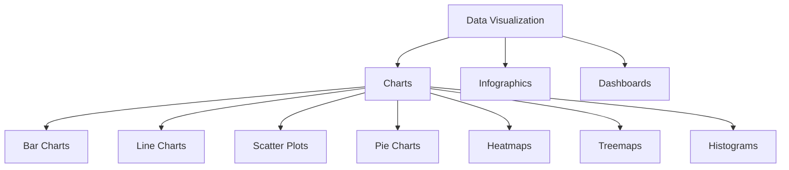

## Introduction

In today's data-driven business landscape, effective data analysis and reporting are crucial for organizations to make informed decisions, optimize operations, and gain a competitive edge. This document will explore the key elements of data analysis and reporting, including key performance indicators (KPIs), analytics tools, and data visualization techniques, providing Mermaid diagrams to illustrate these concepts.

## Key Performance Indicators (KPIs)

KPIs are the vital metrics that organizations use to measure and track the progress and success of their business objectives. Defining and monitoring the right KPIs is essential for data-driven decision-making.

*Figure 1: The KPI lifecycle, highlighting the importance of aligning KPIs with business goals, measuring performance, analyzing trends, and using the insights to inform strategic decisions.*

## Analytics Tools

Organizations leverage a variety of analytics tools to collect, analyze, and report on their data. These tools range from spreadsheets to enterprise-grade business intelligence (BI) platforms, each offering unique capabilities and features.

*Figure 2: A taxonomy of common analytics tools used by organizations, including spreadsheets, BI platforms, reporting software, dashboarding solutions, and data visualization tools.*

## Data Visualization

Effective data visualization is crucial for presenting insights and enabling data-driven decision-making. By leveraging various chart types and graphical representations, organizations can communicate complex information in a clear and impactful manner.

*Figure 3: A classification of common data visualization techniques, including various chart types as well as infographics and dashboards.*

## Conclusion

Data analysis and reporting are essential components of data-driven decision-making. By defining the right KPIs, leveraging powerful analytics tools, and employing effective data visualization techniques, organizations can gain valuable insights, optimize their operations, and stay ahead of the competition. The Mermaid diagrams presented in this document provide a framework for understanding and implementing these crucial elements of data analysis and reporting.

