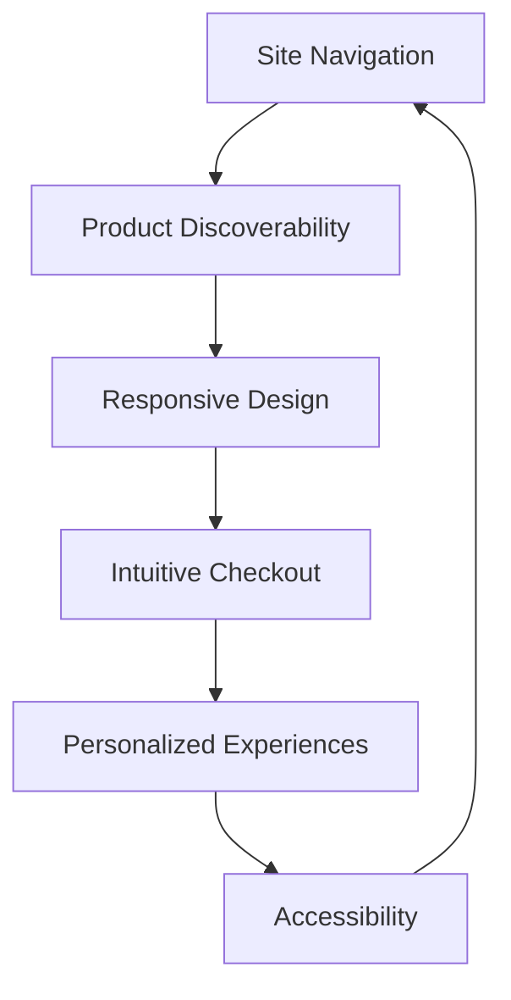
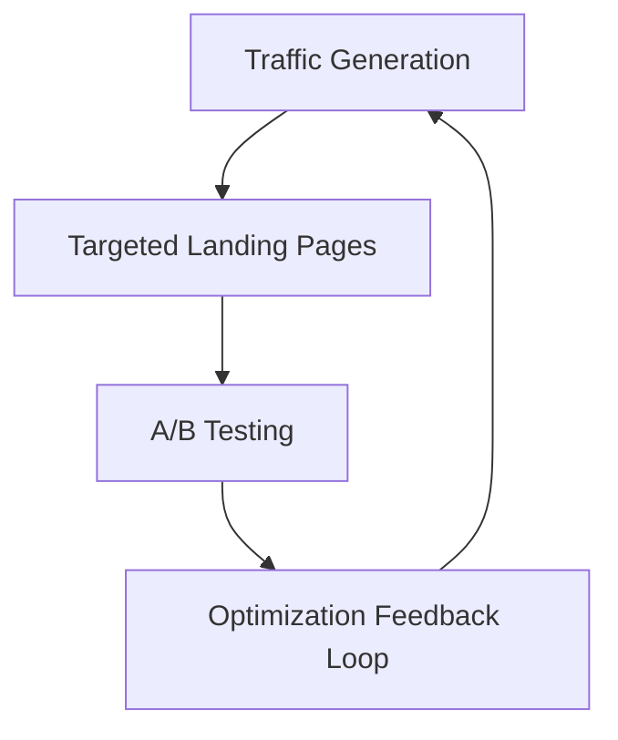
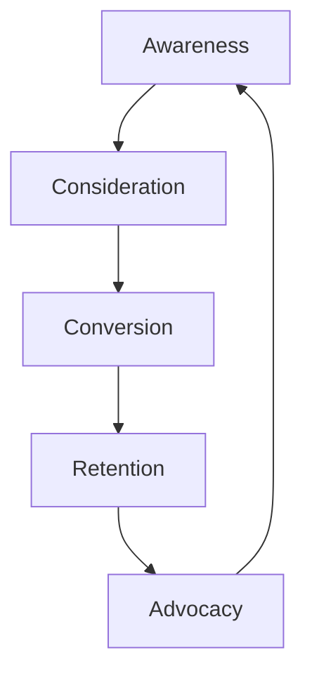

## Introduction

In today's competitive e-commerce landscape, optimizing the user experience (UX), enhancing conversion rates, and mapping the customer journey are vital to driving sustainable business growth. This document explores key strategies and techniques to unlock the full potential of your e-commerce platform, supported by informative Mermaid diagrams.

## User Experience (UX) Improvements

Crafting a seamless and intuitive user experience is the foundation of e-commerce optimization. By focusing on key UX elements, you can captivate visitors and encourage them to convert.

*Figure 1: Key UX elements for e-commerce optimization.*

As illustrated in Figure 1, improving site navigation, enhancing product discoverability, implementing responsive design, streamlining the checkout process, delivering personalized experiences, and ensuring accessibility are critical components of an exceptional e-commerce UX.

## Conversion Rate Optimization (CRO)

Conversion rate optimization is the art of identifying and addressing friction points to drive more users to complete their desired actions, such as making a purchase or signing up for a newsletter.

*Figure 2: The conversion rate optimization (CRO) cycle.*

The CRO cycle, as depicted in Figure 2, involves generating targeted traffic, creating tailored landing pages, conducting A/B testing, and continuously optimizing based on user feedback and performance data.

## Online Customer Journey Mapping

Understanding the customer's end-to-end journey is crucial for identifying pain points and opportunities to enhance engagement and conversions.

*Figure 3: The online customer journey mapping framework.*

Figure 3 illustrates the key stages of the online customer journey: Awareness, Consideration, Conversion, Retention, and Advocacy. By mapping and optimizing each stage, e-commerce businesses can create a seamless and delightful experience that fosters customer loyalty and advocacy.

## Conclusion

Embracing user experience improvements, conversion rate optimization, and online customer journey mapping are essential strategies for e-commerce businesses seeking to thrive in today's competitive landscape. The Mermaid diagrams presented in this document provide a visual framework for understanding and implementing these crucial elements of e-commerce optimization. By focusing on these core pillars, you can unlock enhanced customer engagement, increased conversions, and sustainable business growth.

