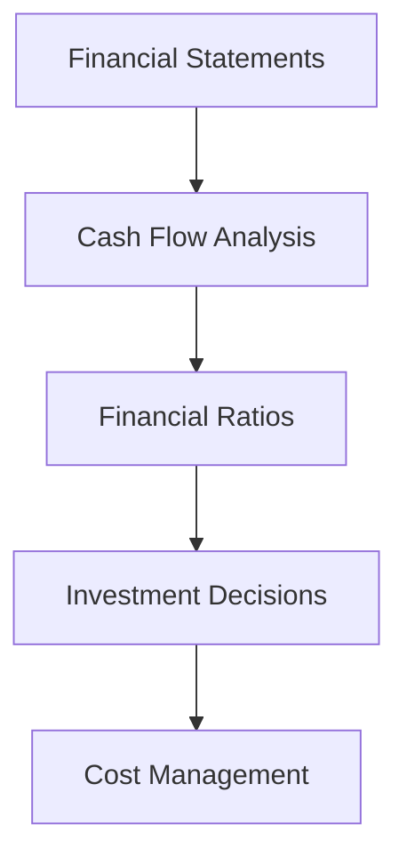
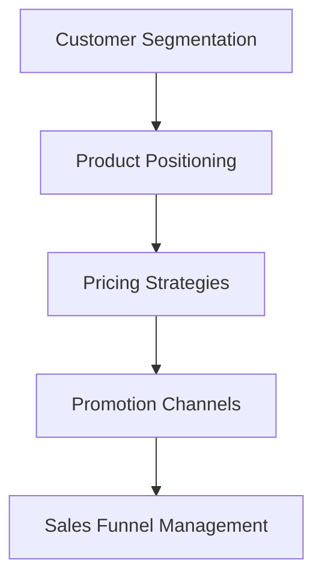
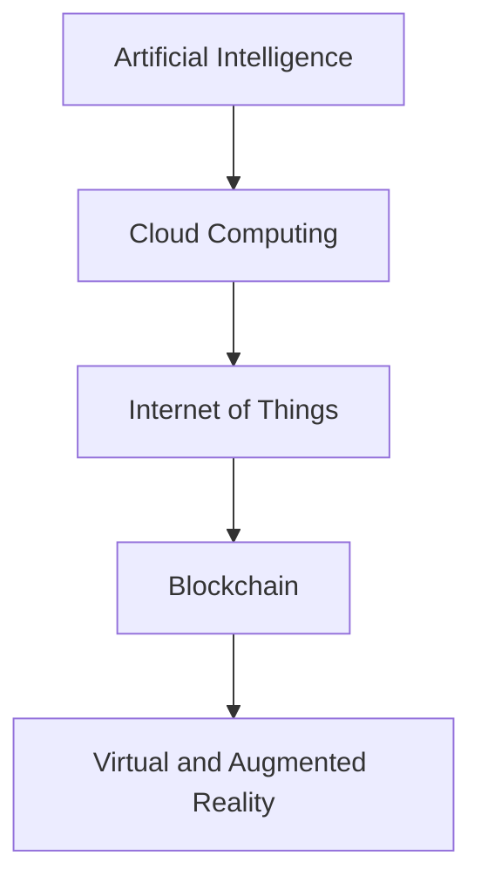
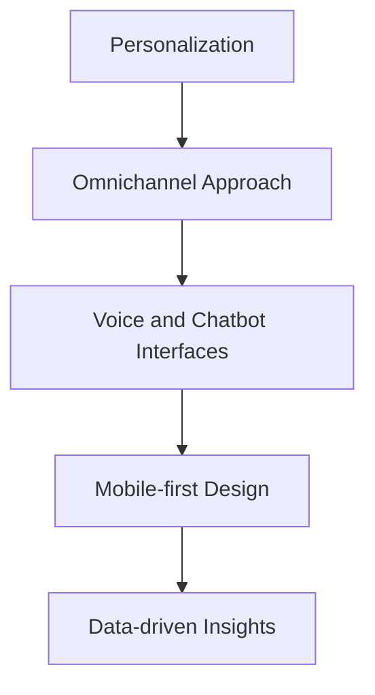

## Introduction
In today's dynamic business landscape, staying attuned to industry-specific knowledge and emerging trends is crucial for organizations to maintain a competitive edge. This document explores the application of BBA (Bachelor of Business Administration) concepts and examines the key trends in the tech industry, providing Mermaid diagrams to illustrate these insights.

## BBA Concepts in Action
The BBA degree equips professionals with a robust foundation in various business disciplines, from finance and marketing to operations and strategy. Let's dive into how these core concepts can be applied to drive business success.

### Finance and Accounting

*Figure 1: Mermaid diagram highlighting the interconnected nature of key finance and accounting concepts.*

### Marketing and Sales

*Figure 2: Mermaid diagram illustrating the key marketing and sales concepts.*

## Tech Industry Trends
As CodeLucky.com is a tech-related business, it's essential to stay informed about the latest trends and developments in the industry. Here are some notable ones:

### Emerging Technologies

*Figure 3: Mermaid diagram depicting the latest emerging technologies in the tech industry.*

### Customer Experience Trends

*Figure 4: Mermaid diagram highlighting the key customer experience trends in the tech industry.*

## Conclusion
By leveraging industry-specific knowledge and staying attuned to the latest trends, organizations can make informed decisions, adapt to market changes, and deliver exceptional value to their customers. The Mermaid diagrams presented in this document provide a visual framework for understanding the interconnected nature of BBA concepts and the evolving landscape of the tech industry. As CodeLucky.com navigates its growth trajectory, these insights can serve as a guiding light for strategic planning and operational excellence.

