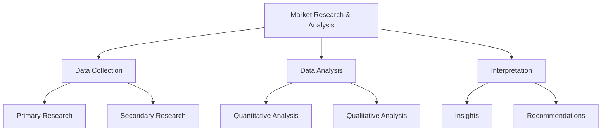
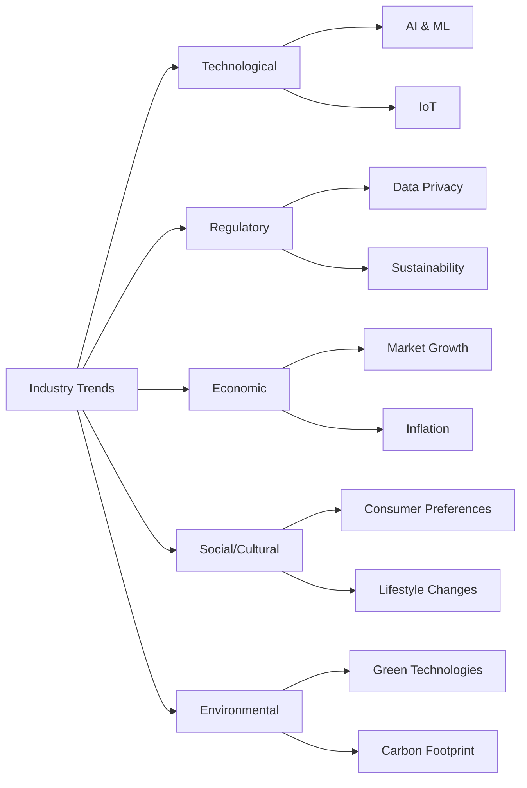
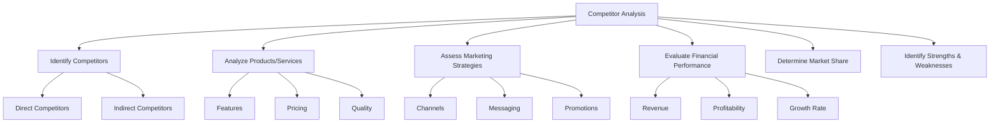
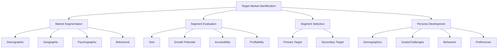

# Market Research and Analysis: A Comprehensive Guide

## Introduction

Market research and analysis are crucial components of any successful business strategy. They provide valuable insights into industry trends, competitor landscapes, and target markets, enabling businesses to make informed decisions and stay competitive.

## 1. Market Research and Analysis Overview

Market research and analysis involve collecting, analyzing, and interpreting data about a market, including customers, competitors, and industry trends. This process helps businesses understand their market environment and make strategic decisions.

## 2. Industry Trends

Industry trends are patterns or shifts in an industry that can impact business operations, consumer behavior, and market dynamics.

### Key Components of Industry Trend Analysis:

1. Technological advancements
2. Regulatory changes
3. Economic factors
4. Social and cultural shifts
5. Environmental concerns

## 3. Competitor Analysis

Competitor analysis involves evaluating your competitors to understand their strengths, weaknesses, strategies, and market position.

### Steps in Competitor Analysis:

1. Identify competitors
2. Analyze their products/services
3. Assess their marketing strategies
4. Evaluate their financial performance
5. Determine their market share
6. Identify their strengths and weaknesses

## 4. Target Market Identification

Target market identification involves segmenting the market and identifying the specific group of consumers most likely to purchase your product or service.

### Steps in Target Market Identification:

1. Market Segmentation
2. Segment Evaluation
3. Segment Selection
4. Persona Development

## Conclusion

Effective market research and analysis, including understanding industry trends, conducting competitor analysis, and identifying target markets, are essential for businesses to make informed decisions, develop effective strategies, and maintain a competitive edge in today's dynamic business environment.
