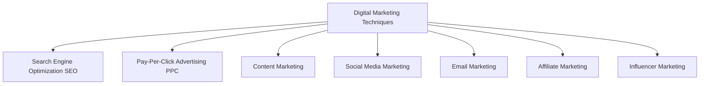
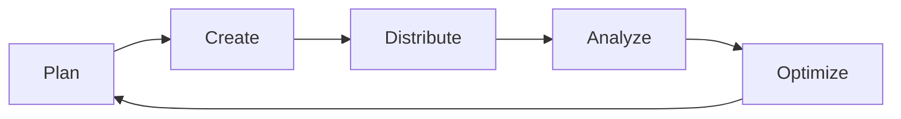
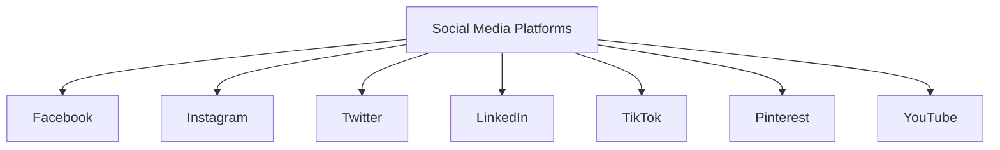
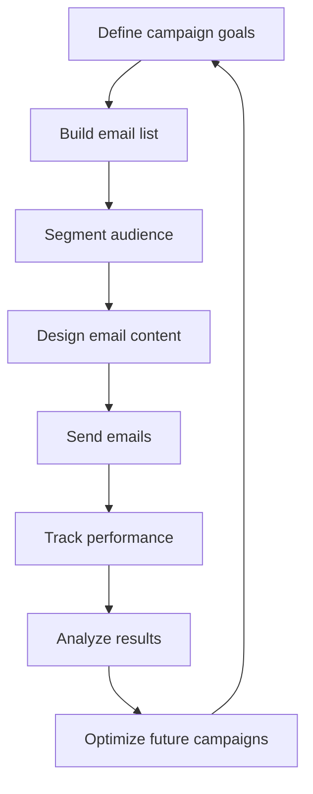

# Marketing Strategies Overview

## 1. Digital Marketing Techniques

Digital marketing encompasses various online strategies to reach and engage target audiences. Here's an overview of key digital marketing techniques:

## 2. Content Marketing

Content marketing involves creating and distributing valuable, relevant content to attract and retain a target audience. Here's a content marketing lifecycle:

### Key elements of content marketing:
- Blog posts
- Videos
- Infographics
- Podcasts
- Ebooks
- Webinars

## 3. Social Media Marketing

Social media marketing leverages social platforms to connect with audiences, build brand awareness, and drive website traffic. Here's an overview of popular social media platforms:

### Social media marketing strategies:
1. Create engaging content
2. Use hashtags strategically
3. Engage with followers
4. Run social media ads
5. Collaborate with influencers
6. Analyze performance metrics

## 4. Email Marketing Campaigns

Email marketing involves sending targeted messages to a group of recipients. Here's a typical email marketing campaign flow:

### Key components of successful email marketing:
- Compelling subject lines
- Personalized content
- Clear call-to-action CTAs
- Mobile-friendly design
- A/B testing
- Automation

By implementing these marketing strategies, businesses can effectively reach their target audience, increase brand awareness, and drive conversions in the digital landscape.
