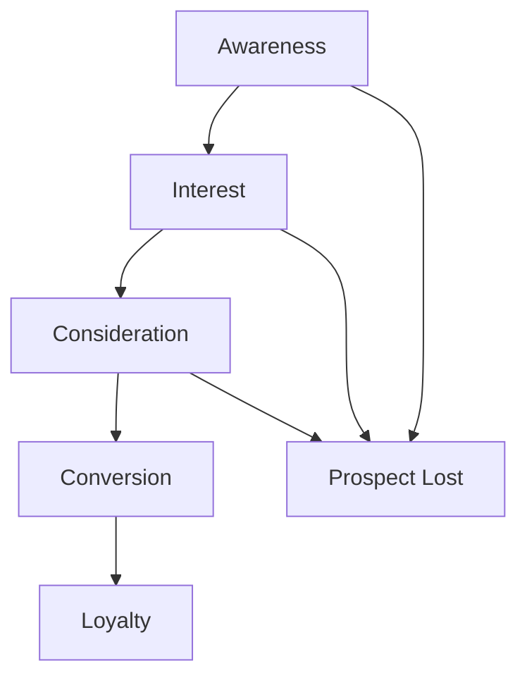

## Introduction
Sales is the lifeblood of any successful business, and mastering effective sales techniques is crucial for driving growth and revenue. In this document, we'll explore key areas of sales, including sales funnel optimization, pitch development, and negotiation skills, accompanied by informative Mermaid diagrams to illustrate these concepts.

## Sales Funnel Optimization
The sales funnel is the journey customers take from initial awareness to becoming a paying client. Optimizing this funnel is essential for converting more leads and maximizing sales.

*Figure 1: The sales funnel, highlighting the key stages from awareness to loyalty, with the potential for prospect loss at each stage.*

As shown in Figure 1, the sales funnel consists of five primary stages: Awareness, Interest, Consideration, Conversion, and Loyalty. By understanding and optimizing each stage, sales teams can improve lead qualification, nurture prospects more effectively, and drive higher conversion rates.

## Pitch Development
A well-crafted sales pitch is essential for capturing the attention of potential customers and convincing them to take action. Effective pitch development involves a structured approach to storytelling and value proposition.

*Figure 2: The pitch development process, including understanding customer needs, crafting a compelling narrative, highlighting unique value, addressing objections, and a clear call to action.*

As illustrated in Figure 2, the pitch development process involves understanding customer needs, crafting a compelling narrative, highlighting the unique value proposition, addressing potential objections, and concluding with a clear call to action. By following this structured approach, sales professionals can deliver impactful and persuasive pitches.

## Negotiation Skills
Effective negotiation skills are critical for securing favorable deals and maintaining strong customer relationships. A structured negotiation process can help sales teams navigate complex discussions and achieve mutually beneficial outcomes.

*Figure 3: The negotiation process, including preparation, establishing common ground, uncovering needs, proposing solutions, reaching an agreement, and following up.*

As shown in Figure 3, the negotiation process involves preparation, establishing common ground with the customer, uncovering their needs, proposing mutually beneficial solutions, reaching an agreement, and following up to ensure successful implementation. By mastering this structured approach, sales teams can navigate negotiations more effectively and achieve favorable outcomes.

## Conclusion
Mastering sales techniques is crucial for driving business growth and success. By optimizing the sales funnel, developing compelling pitches, and honing negotiation skills, sales professionals can enhance their ability to convert leads, close deals, and build long-lasting customer relationships. The Mermaid diagrams presented in this document provide a visual framework for understanding and implementing these essential sales strategies.

